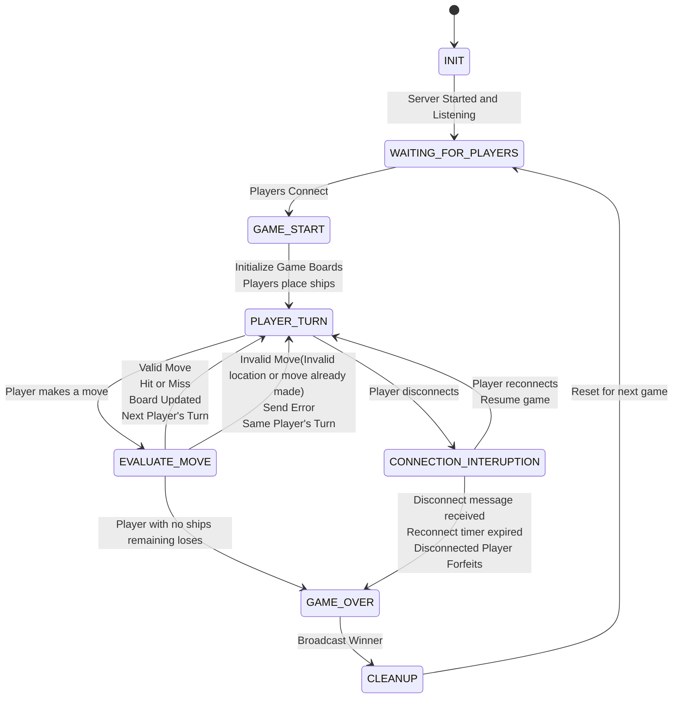

```mermaid
stateDiagram
    [*] --> INIT
    INIT --> WAITING_FOR_PLAYERS : Server Started and Listening
    WAITING_FOR_PLAYERS --> GAME_START : Players Connect
    GAME_START --> PLAYER_TURN : Initialize Game Boards<br>Players place ships
    PLAYER_TURN --> EVALUATE_MOVE : Player makes a move
    EVALUATE_MOVE --> PLAYER_TURN : Valid Move<br>Hit or Miss<br>Board Updated<br>Next Player's Turn
    EVALUATE_MOVE --> PLAYER_TURN : Invalid Move(Invalid location or move already made)<br>Send Error<br>Same Player's Turn
    EVALUATE_MOVE --> GAME_OVER : Player with no ships remaining loses
    PLAYER_TURN --> CONNECTION_INTERUPTION : Player disconnects
    CONNECTION_INTERUPTION --> GAME_OVER : Disconnect message received<br>Reconnect timer expired<br>Disconnected Player Forfeits
    CONNECTION_INTERUPTION --> PLAYER_TURN : Player reconnects<br>Resume game
    GAME_OVER --> CLEANUP : Broadcast Winner
    CLEANUP --> WAITING_FOR_PLAYERS: Reset for next game
```