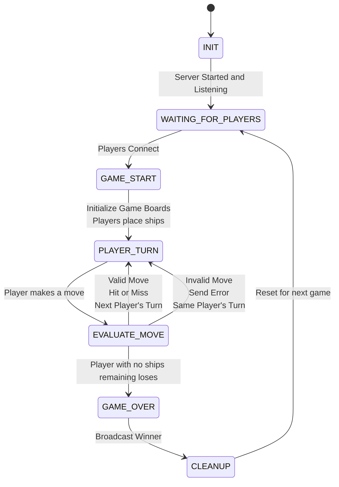

# CS 457 Project Statement of Work (SOW) & Protocol Specification Template

**Student Name:** Garret Gasper  
**Date:** 2026-9-17  
**Course:** CS 457 - Computer Networks  
**Target Server Domain:** `server.gasper.edu`  

---

## 1. Game Selection & Scope (Sprint 0)

> Planning is going to be an iterative process through the sprints so you don't have to have all the details now. Focus on big overview concepts. You will be updating the SOW as we plan.
> You have a lot of freedom to choose a game. There are a couple caveats.  

> - It must run in the console. The lab nodes won't be able to handle extensive graphics.
> - It has to be self-contained. You can use a internet-connector to download you code, but because the architecture must run 5 nodes you won't be able to run 
> - You are encouraged to use python, but I'm not going to make it a strict requirement. The instructor and TA's ability to help with C or Rust, etc will be diminished in other languages.

### 1.1 Game Overview
- **Chosen Game:** Battleship
- **Player Capacity:** 2 Players (Simulated via 2 CML Client nodes)
- **Game Summary:** Each player places their 5 ships on the board, taking turns to guess locations of the other players ships. First player to lose all their ships loses.

### 1.2 Core Game Rules & Win/Draw Conditions
- **Turn Mechanics:** Initial turn is decided via coin flip. After that it alternates which player is currently guessing.
- **Victory Condition:** Opponent has zero ships remaining.
- **Draw/Tie Condition:** There can not be a draw or tie as the game ends as soon as one player has no ships remaining.

---

## 2. Application-Layer Messaging Protocol Blueprint (Sprint 1 Deliverable)

### 2.1 Message Transport & Serialization Format
- **Transport Protocol:** TCP
- **Serialization Format:** [JSON]
- **Framing Mechanism:** [Newline-delimited (`\n`) JSON payloads]

### 2.2 Message Schema Definitions

#### Message Types:
1. `CONNECT` (Client -> Server): Request to join the game room.
```json
{
  "msg_type" : "CONNECT",
  "player_id" : "Player",
  "timestamp" : 00000000000
}
```

2. `LOBBY_WAIT` (Server -> Client): Notification that server is waiting for Player 2.
```json
{
  "msg_type" : "LOBBY_WAIT",
  "player_id" : "Player",
  "timestamp" : 00000000000
}
```

3. `GAME_START` (Server -> Clients): Game initiated, assigns roles (e.g. Player X vs Player O).
```json
{
  "msg_type" : "GAME_START",
  "player_id" : "Player",
  "timestamp" : 00000000000
}
```

4. `MOVE` (Client -> Server): Player action (e.g., cell coordinates or answer choice).
```json
{
  "msg_type" : "CONNECT",
  "player_id" : "Player",
  "payload" {
    "column" : "A",
    "row" : "1"
  },
  "timestamp" : 00000000000
}
```

5. `STATE_UPDATE` (Server -> Clients): Broadcast current game board / state and active player turn.
```json
{
  "msg_type" : "STATE_UPDATE",
  "player_id" : "Player",
  "payload" {
    "move result" : "hit",
    "offense board" : "
    |00|A|B|C|D|E|F|G|H|I|J|
    -----------------------
    |01| | | | | | | | | | |
    ------------------------
    |02| | | | | | | | | | |
    ------------------------
    |03| | | | | | | | | | |
    ------------------------
    |04| | | | | | | | | | |
    ------------------------
    |05| | | | | | | | | | |
    ------------------------
    |06| | | | | | | | | | |
    ------------------------
    |07| | | | | | | | | | |
    ------------------------
    |08| | | | | | | | | | |
    ------------------------
    |09| | | | | | | | | | |
    ------------------------
    |10| | | | | | | | | | |
    ------------------------
    ",

    "defense board" : "
    |00|A|B|C|D|E|F|G|H|I|J|
    -----------------------
    |01| | | | | | | | | | |
    ------------------------
    |02| | | | | | | | | | |
    ------------------------
    |03| | | | | | | | | | |
    ------------------------
    |04| | | | | | | | | | |
    ------------------------
    |05| | | | | | | | | | |
    ------------------------
    |06| | | | | | | | | | |
    ------------------------
    |07| | | | | | | | | | |
    ------------------------
    |08| | | | | | | | | | |
    ------------------------
    |09| | | | | | | | | | |
    ------------------------
    |10| | | | | | | | | | |
    ------------------------
    "

  },
  "timestamp" : 00000000000
}
```

6. `GAME_OVER` (Server -> Clients): Victory / Draw notification with final scores.
```json
{
  "msg_type" : "GAME_OVER"
  "player_id" : "Player"
  "payload" : {
    "winner" : "Player_1",
    
  },
  "timestamp" : 00000000000
}
```

7. `ERROR` (Server -> Client): Invalid move or malformed packet error.
```json
{
  "msg_type" : "ERROR"
  "player_id" : "Player"
  "payload" : {
    "error_code" : 400,
    "error_message" : "Invalid move: Cell already guessed."
  },
  "timestamp" : 00000000000
}
```

8. `DISCONNECT` (Client -> Server): Player voluntarily leaves the game.
```json
{
  "msg_type" : "DISCONNECT"
  "player_id" : "Player"
  "timestamp" : 00000000000
}
```


#### Example JSON Protocol Schema:
```json
{
  "msg_type": "MOVE",
  "player_id": "Player_1",
  "payload": {
    "row": 0,
    "col": 2
  },
  "timestamp": 1727000000
}
```

---

### 2.3 Game State Machine (FSM) Design (Sprint 1 Deliverable)
- **State Transitions:** Detail state flow: `INIT` -> `WAITING_FOR_PLAYERS` -> `PLAYER_TURN` -> `EVALUATE_MOVE` -> `CHECK_WIN_DRAW` -> `GAME_OVER` -> `CLEANUP`.



---

## 3. Game Behavior & Server Concurrency Architecture (Sprint 2 Deliverable)

### 3.1 Server Concurrency Strategy
- **Architecture Choice:** [Multi-Threading (`threading.Thread`) OR Non-blocking I/O multiplexing (`select.select` / `selectors`)]
- **Synchronization Logic:** Explain how shared game state and client list are thread-safe (e.g. `threading.Lock`) to prevent race conditions during turn processing.

### 3.2 State & Score Synchronization Across Clients
- **Turn Enforcement:** Detail how the server validates active player ID before processing moves and broadcasts updated turn notifications to all clients.
- **Score & Board Synchronization:** Describe how state broadcasts keep client screens synchronized in real time.

---

## 4. Coding & AI Implementation Plan (Sprint 3)

- **Permitted AI Tools:** [e.g., GitHub Copilot, ChatGPT, Claude]
- **AI Prompting & Constraint Strategy:** Explain how you will constrain AI models to generate code (in Python or your chosen language) that adheres strictly to the protocol blueprint and FSM designed in Sprints 1 & 2.
- **Implementation Risk Management:** Detail your plan to leverage past programming experience and manage time to ensure code completion on schedule.

---

## 5. CML Multi-Subnet Topology & Wireshark Deployment Plan (Sprint 4 & 5 Deliverable)

> For now you can use the topology below. We may update this when we get to defining subnets.

### 5.1 Subnet & Router Design
- **Subnet A (Client 1):** `192.168.10.0/24` (Interface `Gi0/1` on Router R1)
- **Subnet B (Client 2):** `192.168.11.0/24` (Interface `Gi0/2` on Router R1)
- **Subnet C (Game Server):** `192.168.20.0/24` (Interface `Gi0/1` on Router R2)
- **Router Backbone:** `10.0.0.0/30` (Interface `Gi0/0` on R1 <-> `Gi0/0` on R2)

### 5.2 DHCP Pools & DNS Configuration Plan
- **Router R1 DHCP Pool 1 (`CLIENT1_POOL`):** Leases `192.168.10.10` - `192.168.10.50`, gateway `192.168.10.1`, DNS `10.0.0.2`.
- **Router R1 DHCP Pool 2 (`CLIENT2_POOL`):** Leases `192.168.11.10` - `192.168.11.50`, gateway `192.168.11.1`, DNS `10.0.0.2`.
- **Router R2 Authoritative DNS:** Configured with `ip dns server` and static host mapping `server.[yourlastname].edu` -> `192.168.20.100`.

### 5.3 Deployment Strategy & Wireshark Trace Capture
- **CML Deployment Strategy:** Deploy `server.py` onto Subnet C node (`192.168.20.100`) behind Router R2, and `client.py` onto Subnet A and Subnet B nodes behind Router R1.
- **Cisco Infrastructure Configuration:** Router R1 DHCP pools (`CLIENT1_POOL`, `CLIENT2_POOL`) and Router R2 authoritative DNS (`ip host server.[lastname].edu 192.168.20.100`).
- **Wireshark Trace Capture Plan:** Capture DHCP DORA exchange (`dhcp_negotiation.pcap`) and DNS query/response resolution (`dns_lookup.pcap`).
